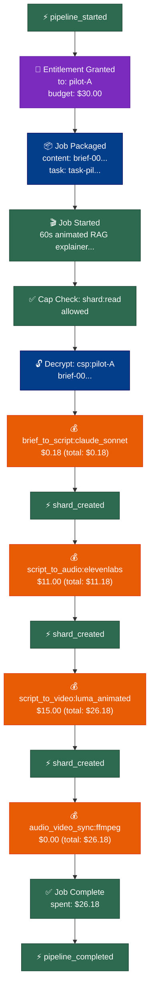
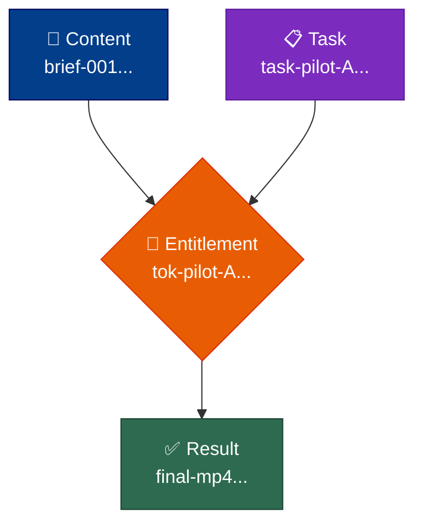

# Building Traced Workflows

A 60-second animated explainer cost $26 to produce. The script came back clean from Sonnet, ElevenLabs rendered the voiceover, Luma generated the scene videos, then FFmpeg's audio-video sync crashed on a malformed timestamp. Without checkpoints, restart means re-running the whole pipeline — every Sonnet call, every ElevenLabs minute, every Luma second. With checkpoints, restart picks up at the sync stage and salvages everything upstream.

That's the pattern this doc covers: wrap each stage with `emit()` calls, persist a checkpoint shard at every boundary, and verify the chain at the end. About two lines of glue per stage; the helpers are written once and shared across pipelines.

This doc uses the **Claude Studio Producer** pipeline as the running example. CSP today uses a coarser checkpoint format (`RunManifest`) and audio is still on the roadmap — what's described here is the migration target. The shapes work for any multi-stage pipeline; CSP earns the example slot because the cost asymmetry between cheap and expensive stages makes the value of checkpoints viscerally clear.

## What You Get

- **Hash-chained trace events** — tamper-evident receipt for every stage, every LLM call, every shard hand-off.
- **Checkpoint shards** — resumable state between stages, scoped with `DecayClass.CHECKPOINT` so they auto-prune after 4 hours.
- **Budget tracking** — per-stage and per-agent spend, with hard caps that raise instead of silently overspending.
- **Provenance reports** — Mermaid diagrams (workflow / genealogy / multi-agent) rendered from the same trace JSONL.

The cost is roughly 50 lines of glue on top of your existing logic. None of it is novel — every primitive lives in [spiritwriter.fabric](../spiritwriter/fabric).

## The CSP Pipeline

A single CSP production run goes through five stages from brief to published asset. Each stage's output is the next stage's input:

| # | Stage | Producer | Output | Typical Cost (60s animated) |
|---|-------|----------|--------|------------------------------|
| 1 | `brief_to_script` | ScriptWriterAgent (Sonnet) | Scene list with voiceover text | $0.18 |
| 2 | `script_to_audio` | AudioGeneratorAgent (ElevenLabs/Mubert) | Voiceover MP3 + music bed | $11.00 (TIME_SYNCED + 12 scenes) |
| 3 | `script_to_video` | VideoGeneratorAgent (Luma/Runway/Pika) | Per-scene video clips | $15.00 (60s × $0.25/sec) |
| 4 | `audio_video_sync` | SyncAgent (local FFmpeg) | Synced master MP4 | $0.00 |
| 5 | `publish` | PublishAgent (local + uploads) | Final published asset + URL | $0.00 |

**Total: ~$26.18.** Stages 2 and 3 dominate; stages 1, 4, 5 are nearly free in comparison. That asymmetry is what makes checkpointing pay off — a crash in stage 4 (sync) without checkpoints re-runs $26 of work; with checkpoints it costs you a coffee.

### Where Checkpoints Save Real Money

Three actual failure modes from the CSP repo and the migration target:

| Failure Point | Without Checkpoints | With Checkpoints |
|---------------|---------------------|------------------|
| Audio render fails after script (TTS provider down) | Re-run script ($0.18) + audio ($11) = **$11.18** | Re-run audio only = **$11.00** |
| Sync fails after script + audio + video succeed | Re-run all upstream = **$26.18** | Re-run sync only = **$0.00** |
| Publish fails after master MP4 lands | Re-run all upstream = **$26.18** | Re-run publish only = **$0.00** |

The single $26 asymmetric flow is the right shape to teach the pattern on. Real CSP also fans out 3 competitive pilots in parallel (Producer plans, picks the best result via Critic) — the pattern composes by giving each pilot its own emitter and tagging events with `pilot_id`. The teaching example below stays linear; the parallel case is in [Multi-Pilot Fan-Out](#multi-pilot-fan-out) at the end.

## Quick Start

### Define the Stages

```python
STAGES = [
    "brief_to_script",
    "script_to_audio",
    "script_to_video",
    "audio_video_sync",
    "publish",
]
```

### Set Up Store and Emitter

```python
from spiritwriter.fabric.emitter import TraceEmitter
from spiritwriter.fabric.store import ShardStore

store = ShardStore("/path/to/shards")
emitter = TraceEmitter(
    run_id="csp-2026-04-29-001",     # any string identifying this run
    agent_id="csp-orchestrator",
    out_path="csp-run.jsonl",
)
```

`TraceEmitter` writes JSONL append-only. One emitter per output file — multiple producers writing to the same path will interleave lines and break chain verification.

### Wrap Each Stage

Two `emit()` calls bracket each stage's existing logic. `emit()` takes the event type and arbitrary keyword fields:

```python
emitter.emit("stage_started", stage="script_to_audio", input_ref=script_shard.shard_id)

# ...call ElevenLabs, render voiceover, persist audio MP3...

emitter.emit("stage_completed",
             stage="script_to_audio",
             output_ref=audio_shard.shard_id,
             cost_usd=11.00,
             duration_seconds=60)
```

### Write a Checkpoint Shard

After each stage, persist resume state as a `CHECKPOINT`-class shard:

```python
from spiritwriter.fabric.shard import MemoryShard, ShardAtom, AtomKind, DecayClass

checkpoint = MemoryShard(
    atoms=[
        ShardAtom(text="Stage complete", kind=AtomKind.CHECKPOINT,
                  key="stage", value="script_to_audio_complete"),
        ShardAtom(text="Audio asset reference", kind=AtomKind.CONTEXT,
                  key="audio_shard_ref", value=audio_shard.shard_id),
        ShardAtom(text="Cumulative spend", kind=AtomKind.FACT,
                  key="spent_usd", value="11.18"),
    ],
    scope="csp:in-progress",
    origin="csp-orchestrator",
    decay_class=DecayClass.CHECKPOINT,   # auto-prune after 4 hours
    tags=["checkpoint", "csp", "run-001"],
)

ref = store.put(checkpoint)
store.set_ref("csp:run-001:checkpoint", ref.shard_id)
```

The named ref is what makes resume work — it's a stable handle the next process can look up regardless of what shard ID got minted. The `audio_shard_ref` carries forward the expensive output (the MP3 itself lives wherever the audio agent persisted it; the shard atom carries the pointer).

### Resume from Checkpoints

On startup, find the last completed stage and resume after it:

```python
def get_resume_stage(store, stages, run_id="run-001"):
    """Return (next_stage_to_run, checkpoint_shard_or_None)."""
    shard = store.resolve_ref(f"csp:{run_id}:checkpoint")
    if shard is None:
        return stages[0], None    # nothing to resume from

    atom = shard.get_atom("stage")
    if atom is None:
        return stages[0], None

    # Stage names must not contain "_complete" as a substring — see note below.
    completed = atom.value.replace("_complete", "")
    if completed in stages:
        next_idx = stages.index(completed) + 1
        if next_idx < len(stages):
            return stages[next_idx], shard

    return stages[0], None
```

**Naming gotcha.** This helper recovers the completed stage by stripping `_complete` from the atom value. If a stage name itself contains `_complete` as a substring (e.g. `validation_complete_check`), the strip mangles it. Either keep stage names free of that substring, or replace this with a structured key — `key="completed_stage"`, `value=stage` (no suffix manipulation). The shape below in the Complete Pipeline Template uses the same convention; change both if you change one.

### Verify and Render

After all stages complete:

```python
from spiritwriter.fabric.emitter import verify_chain
from spiritwriter.fabric.visualize import load_trace, render_trace

events = emitter.get_events()
assert verify_chain(events), "Trace chain integrity check failed"

# Render as Mermaid — render_trace takes events, not a path
mermaid_code = render_trace(events, diagram_type="workflow")
```

`render_trace` accepts the diagram types `"workflow"`, `"genealogy"`, and `"multi-agent"` (note the hyphen). For an arbitrary trace file produced elsewhere, use `load_trace(path)` first. See [Provenance Reports](#provenance-reports) below for what each diagram looks like.

## Complete Pipeline Template

Copy this and customize the stage handlers:

```python
"""Traced workflow template — copy and customize."""

from spiritwriter.fabric.emitter import TraceEmitter, verify_chain
from spiritwriter.fabric.store import ShardStore
from spiritwriter.fabric.shard import MemoryShard, ShardAtom, AtomKind, DecayClass
from spiritwriter.fabric.visualize import render_trace


STAGES = [
    "brief_to_script",
    "script_to_audio",
    "script_to_video",
    "audio_video_sync",
    "publish",
]

STAGE_HANDLERS = {
    "brief_to_script":  lambda store, prev: do_script(store, prev),
    "script_to_audio":  lambda store, prev: do_audio(store, prev),
    "script_to_video":  lambda store, prev: do_video(store, prev),
    "audio_video_sync": lambda store, prev: do_sync(store, prev),
    "publish":          lambda store, prev: do_publish(store, prev),
}


def write_checkpoint(store, stage, result_ref, run_id, cumulative_spend):
    checkpoint = MemoryShard(
        atoms=[
            ShardAtom(text=f"Stage {stage} complete", kind=AtomKind.CHECKPOINT,
                      key="stage", value=f"{stage}_complete"),
            ShardAtom(text="Output reference", kind=AtomKind.CONTEXT,
                      key="output_ref", value=result_ref),
            ShardAtom(text="Cumulative spend", kind=AtomKind.FACT,
                      key="spent_usd", value=f"{cumulative_spend:.2f}"),
        ],
        scope="csp:in-progress",
        origin="csp-orchestrator",
        decay_class=DecayClass.CHECKPOINT,
        tags=["checkpoint", "csp", run_id],
    )
    ref = store.put(checkpoint)
    store.set_ref(f"csp:{run_id}:checkpoint", ref.shard_id)
    return checkpoint


def get_resume_stage(store, stages, run_id):
    shard = store.resolve_ref(f"csp:{run_id}:checkpoint")
    if shard is None:
        return stages[0], None
    atom = shard.get_atom("stage")
    if atom is None:
        return stages[0], None
    completed = atom.value.replace("_complete", "")
    if completed in stages:
        next_idx = stages.index(completed) + 1
        if next_idx < len(stages):
            return stages[next_idx], shard
    return stages[0], None


def run_pipeline(store_path, trace_path, run_id="run-001"):
    store = ShardStore(store_path)
    emitter = TraceEmitter(
        run_id=run_id,
        agent_id="csp-orchestrator",
        out_path=trace_path,
    )

    resume_stage, checkpoint = get_resume_stage(store, STAGES, run_id)
    print(f"Resuming from: {resume_stage}")

    emitter.emit("pipeline_started", run_id=run_id, resume_from=resume_stage)

    prev = checkpoint
    cumulative_spend = 0.0
    for stage in STAGES[STAGES.index(resume_stage):]:
        emitter.emit("stage_started",
                     stage=stage,
                     input_ref=prev.shard_id if prev else None)

        try:
            result_ref, stage_cost = STAGE_HANDLERS[stage](store, prev)
        except Exception as e:
            emitter.emit("stage_failed", stage=stage, error=str(e))
            raise

        cumulative_spend += stage_cost
        prev = write_checkpoint(store, stage, result_ref, run_id, cumulative_spend)
        emitter.emit("stage_completed",
                     stage=stage,
                     output_ref=result_ref,
                     cost_usd=stage_cost,
                     cumulative_usd=cumulative_spend,
                     checkpoint_ref=prev.shard_id)

        print(f"  ✓ {stage} complete (${stage_cost:.2f})")

    store.delete_ref(f"csp:{run_id}:checkpoint")
    store.set_ref(f"csp:{run_id}:result", result_ref)

    emitter.emit("pipeline_completed", run_id=run_id, result_ref=result_ref,
                 total_spent_usd=cumulative_spend)

    events = emitter.get_events()
    chain_ok = verify_chain(events)
    print(f"  Chain integrity: {'✓' if chain_ok else '✗'} ({len(events)} events)")
    print(f"  Total spent: ${cumulative_spend:.2f}")

    mermaid = render_trace(events, diagram_type="workflow")

    return {
        "result_ref": result_ref,
        "chain_intact": chain_ok,
        "event_count": len(events),
        "total_spent_usd": cumulative_spend,
        "provenance_mermaid": mermaid,
    }
```

The `delete_ref` + `set_ref` pair at the end is deliberate: clear the checkpoint pointer (so a re-run starts fresh) and store a stable handle to the final result. The `cumulative_spend` carried in the checkpoint atom lets you resume after a crash and know exactly where the budget stood — without re-tallying the trace JSONL.

## Multi-Agent Pipelines

Each CSP stage runs in a different agent with a different model or external provider. The trace's `agent_id` field is the link — each agent gets its own emitter, all writing to the same JSONL or to per-agent files merged at the end:

```python
AGENT_MAP = {
    "brief_to_script":  "script-writer",     # Claude Sonnet
    "script_to_audio":  "audio-generator",   # ElevenLabs / Mubert provider
    "script_to_video":  "video-generator",   # Luma / Runway / Pika provider
    "audio_video_sync": "sync-agent",        # local FFmpeg
    "publish":          "publish-agent",     # local + S3/YouTube uploads
}
```

The trace events show which agent did what, with cost and duration:

```
stage_started   {agent_id: "script-writer",   stage: "brief_to_script"}
stage_completed {agent_id: "script-writer",   stage: "brief_to_script", cost_usd: 0.18}
stage_started   {agent_id: "audio-generator", stage: "script_to_audio"}
stage_completed {agent_id: "audio-generator", stage: "script_to_audio", cost_usd: 11.00}
stage_started   {agent_id: "video-generator", stage: "script_to_video"}
stage_completed {agent_id: "video-generator", stage: "script_to_video", cost_usd: 15.00}
```

`render_trace(events, diagram_type="multi-agent")` produces a swim-lane diagram showing each agent's contribution — see [Provenance Reports](#provenance-reports) for an example.

## Budget Tracking

`BudgetTracker` enforces a hard cap. It raises `StudioRunnerError` when a spend would exceed the budget — fail-loud rather than silently overspending:

```python
from spiritwriter.fabric.studio_runner import BudgetTracker

# CSP allocates per-pilot budgets. A $30 cap is plenty for a 60s animated piece.
tracker = BudgetTracker(
    budget_usd=30.00,
    token_id="tok-pilot-A",        # optional — for trace correlation
    tracer=emitter,                # optional — emits budget_spent events
)

tracker.record(label="brief_to_script:claude_sonnet",       amount=0.18)
tracker.record(label="script_to_audio:elevenlabs_60s",      amount=11.00)
tracker.record(label="script_to_video:luma_animated_60s",   amount=15.00)

tracker.spent       # 26.18
tracker.remaining   # 3.82
tracker.can_spend(5.00)   # False — would exceed budget
```

Note: the API is `record(label, amount)`, not `spend(amount, label)`. Arg order is label first.

For CSP's competitive-pilot architecture, allocate a per-pilot budget at fan-out time:

```python
# Producer plans 3 pilots, each capped at $30
pilots = [
    BudgetTracker(budget_usd=30.0, token_id=f"tok-pilot-{name}", tracer=emitter)
    for name in ("A", "B", "C")
]
# Each pilot runs its own pipeline; Critic picks the winner from completed ones
```

## Scoped Access via Entitlements

For sensitive inputs (a customer brief, an unreleased product spec), encrypt the input shard and grant scoped access per agent:

```python
from spiritwriter.fabric.crypto import generate_job_key
from spiritwriter.fabric.entitlement import create_entitlement, Capability

key = generate_job_key()
encrypted_brief = store.encrypt_and_store(brief_shard, key)

token = create_entitlement(
    granted_to="script-writer",
    granted_by="csp-orchestrator",
    shard_keys={encrypted_brief.shard_id: key},   # raw bytes; create_entitlement serializes
    scopes=["csp:run-001"],
    capabilities=[Capability.SHARD_READ],
    secrets=[],                                    # no secret-store entitlements
    budget_usd=0.50,                               # script-writer subset of the pilot budget
    expires_at="2026-12-31T23:59:59Z",             # ISO timestamp; optional
)

# The script-writer agent hydrates with their token; the store enforces all checks
context = store.hydrate_with_entitlement(token)
```

The store enforces three checks before decryption: token not expired → has `SHARD_READ` → per-shard scope matches the token's `scopes` patterns. Any failure raises `PermissionError` *before* any plaintext is touched. See [encryption.md](encryption.md#entitlement-tokens) for the full validation order and the per-shard-key distribution pattern.

## Per-Stage Overhead

| What you add | Lines | When |
|--------------|-------|------|
| `emitter.emit("stage_started", ...)` | 1 | Before stage logic |
| `emitter.emit("stage_completed", ...)` | 1 | After stage logic |
| `write_checkpoint(...)` | 1 call site (~15 lines in helper) | After stage logic |
| `get_resume_stage(...)` | 1 call site (~15 lines in helper) | At pipeline start |
| `verify_chain(events)` | 1 | At pipeline end |
| `render_trace(events, diagram_type=...)` | 1 | At pipeline end |
| `BudgetTracker.record(label, amount)` | 1 per LLM/provider call | Optional |
| Entitlement setup | ~10 | Optional, for sensitive data |

**Total per stage: 2-3 lines.** The helpers are written once and reused across pipelines.

## Provenance Reports

The trace JSONL is the source of truth for both audit and visualization. Three diagram types from the same events:

```python
from spiritwriter.fabric.visualize import render_trace, load_trace

events = emitter.get_events()              # in-memory
# or: events = load_trace("csp-run.jsonl") # from disk

render_trace(events, diagram_type="workflow")     # stages and transitions
render_trace(events, diagram_type="genealogy")    # which shard derived from which
render_trace(events, diagram_type="multi-agent")  # which agent did what
```

Output is Mermaid markdown. The examples below were generated from a real CSP-shaped trace — pipeline_started → entitlement_granted → script + audio + video stages → critic → pipeline_completed.

### Workflow

The linear flow of events with per-stage spend annotations. Each `budget_spent` event becomes an orange node showing the cost; shard hand-offs are blue; entitlement grants purple. Useful for "what happened in what order, and what did each step cost":



### Genealogy

The shard derivation tree — content shards on the left, task shards in the middle, results on the right, entitlements as the bridges that authorize the work. Useful for "where did this final asset come from? what was used to produce it?":



For multi-pilot runs, each pilot's content + task + result triangle appears alongside the others, with the Critic's selection clearly marked as the chosen result.

### Multi-Agent

Swim lanes by agent, showing exactly which agent did what work. Each subgraph is one agent (one `agent_id`); the events flow downward within a lane and across lanes as work hands off. Useful for "who's responsible for which part of this trace, and where did the cost land":


The cost-by-agent view is what makes this diagram earn its keep on a 12-pilot CSP run — at a glance you can see ElevenLabs ate $132, Luma ate $180, and the orchestration layer is rounding error.

## Multi-Pilot Fan-Out

CSP's full architecture isn't a single linear pipeline — it's three pilots running in parallel, each with its own budget, all racing toward the same brief. The Critic compares completed pilots and picks one. The trace pattern composes:

```python
import asyncio

async def run_pilot(pilot_name: str, brief_shard, tracer):
    """Run one pilot end-to-end with its own emitter."""
    emitter = TraceEmitter(
        run_id=f"csp-run-001",         # shared run_id across pilots
        agent_id=f"pilot-{pilot_name}",
        out_path=f"csp-run-001-pilot-{pilot_name}.jsonl",
    )
    # ... run STAGES end-to-end as in the template above ...
    return result_ref, emitter

# Producer fans out
results = await asyncio.gather(
    run_pilot("A", brief, parent_tracer),
    run_pilot("B", brief, parent_tracer),
    run_pilot("C", brief, parent_tracer),
)

# Merge traces for unified provenance report
all_events = []
for _, emitter in results:
    all_events.extend(emitter.get_events())
all_events.sort(key=lambda e: e["ts"])

# Render multi-agent diagram showing all three pilots side by side
mermaid = render_trace(all_events, diagram_type="multi-agent")
```

Each pilot has its own `agent_id` and its own JSONL — chain verification works per-pilot. The merged event list still renders cleanly because `render_multi_agent` groups by `agent_id` automatically. Cross-pilot ordering uses timestamps; per-pilot ordering uses the chain.

The Critic's decision becomes another event:

```python
emitter.emit("critic_selected_winner",
             pilot="A",
             pilot_score=92,
             other_scores={"B": 87, "C": 81},
             rationale="A's pacing matched the brief's 60s target most closely")
```

That event lands in the orchestrator's trace and shows up in the workflow diagram as the convergence point.

## Claude Code Integration

For pipelines where each stage runs as a separate Claude Code invocation, the checkpoint pattern translates directly. Each invocation reads the checkpoint, runs one stage, writes the next checkpoint, exits. A shell loop drives the sequence:

```bash
STAGES=("brief_to_script" "script_to_audio" "script_to_video" "audio_video_sync" "publish")
RUN_ID="run-$(date +%Y%m%d-%H%M%S)"

for stage in "${STAGES[@]}"; do
    claude -p --permission-mode acceptEdits --max-turns 20 \
        "Read csp:${RUN_ID}:checkpoint. Run $stage stage only. Write checkpoint. Exit." \
        2>&1 | tee "logs/${RUN_ID}-${stage}.log"

    python3 -c "
from spiritwriter.fabric.store import ShardStore
store = ShardStore('/path/to/shards')
c = store.resolve_ref('csp:${RUN_ID}:checkpoint')
assert c.get_atom('stage').value == '${stage}_complete', 'Checkpoint missing!'
print('✓ $stage verified')
" || { echo "Stage $stage failed"; exit 1; }
done
```

Each invocation is a fresh process. The checkpoint shard is what carries state across them — Claude Code itself doesn't need to know about pipelines, only how to read and write shards.

## What This Pattern Is Not

- **Not transaction-safe across stages.** A crash mid-stage may leave the trace ahead of the checkpoint (the `stage_started` event written, no `stage_completed` yet). On resume, the chain is still valid, but the stage will re-run. Make stage handlers idempotent — for CSP, that means TTS/video providers should accept a deterministic request ID and return the same asset URL on retry, or your stage handler should check the store for an existing output before billing.
- **Not for sub-second steps.** The overhead (emit + checkpoint write) is dominated by filesystem syncs — each stage costs a few ms. Fine for stages measured in seconds; wasteful for stages measured in microseconds.
- **Not a replacement for retries.** If a stage fails transiently (provider rate-limit, transient network error), this pattern lets you resume after a crash but doesn't decide *whether* to retry. Wrap stage handlers with your own retry logic before reaching for this — CSP's `_generate_with_retry` (3 attempts, exponential backoff) is a good template.
- **Not concurrency-safe across writers on one file.** One emitter per trace file. For parallel stages or parallel pilots, give each its own trace file and merge after by sorting on `ts`.

## File Reference

| File | What it does |
|------|--------------|
| `spiritwriter/fabric/shard.py` | `MemoryShard`, `ShardAtom`, content addressing |
| `spiritwriter/fabric/store.py` | `ShardStore`, refs, checkpoint persistence |
| `spiritwriter/fabric/emitter.py` | `TraceEmitter`, hash chain, `verify_chain` |
| `spiritwriter/fabric/visualize.py` | Mermaid diagram generation |
| `spiritwriter/fabric/crypto.py` | AES-256-GCM shard encryption |
| `spiritwriter/fabric/entitlement.py` | Scoped access tokens |
| `spiritwriter/fabric/studio_job.py` | Job packaging |
| `spiritwriter/fabric/studio_runner.py` | Job execution, `BudgetTracker` |
