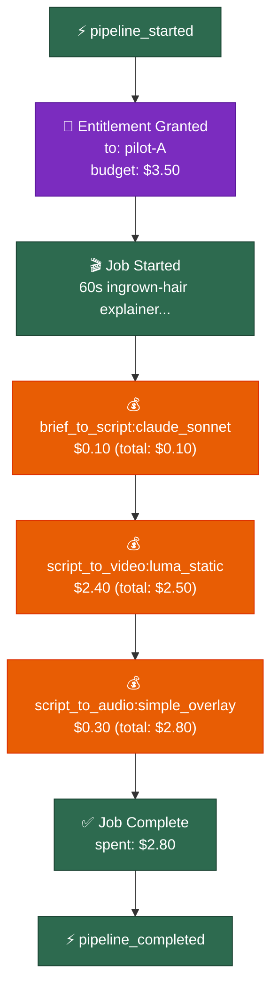
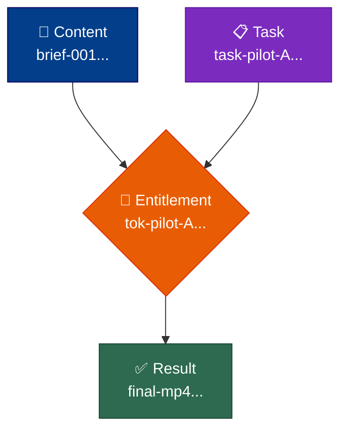

# Building Traced Workflows

A long-running multi-stage pipeline crashes halfway through. The choices are: restart from scratch (lose hours of work and cost), or restart from where it left off (need to know what completed, what didn't, and what state to resume from). The **traced workflow pattern** gives you both — a tamper-evident receipt for every stage, and a checkpoint shard at every boundary so resume is a one-line lookup.

The recipe: wrap each stage with two `emit()` calls (started, completed), persist a checkpoint shard between stages, and verify the chain at the end. About two lines of glue per stage; the helpers are written once and shared across pipelines.

This doc covers the generic shape first, then walks a worked example using [Claude Studio Producer](https://github.com/aaronmarkham/claude-studio-producer) — a real media-production pipeline where the cost asymmetry between cheap and expensive stages makes the value of checkpoints concrete.

## What You Get

- **Hash-chained trace events** — tamper-evident receipt for every stage, every LLM call, every shard hand-off.
- **Checkpoint shards** — resumable state between stages, scoped with `DecayClass.CHECKPOINT` so they auto-prune after 4 hours.
- **Budget tracking** — per-stage and per-agent spend, with hard caps that raise instead of silently overspending.
- **Provenance reports** — Mermaid diagrams (workflow / genealogy / multi-agent) rendered from the same trace JSONL.

The cost is roughly 50 lines of glue on top of your existing logic. None of it is novel — every primitive lives in [spiritwriter.fabric](../spiritwriter/fabric).

## Quick Start

The minimum viable traced workflow has five moving parts: stage list, store, emitter, per-stage emit pair, and final verification. The example below uses generic stages — substitute your own.

### Define the Stages

```python
STAGES = ["ingest", "extract", "generate", "validate", "assemble"]
```

### Set Up Store and Emitter

```python
import os
from spiritwriter.fabric.emitter import TraceEmitter
from spiritwriter.fabric.store import ShardStore

store = ShardStore(os.environ.get("SPIRITWRITER_STORE", "/path/to/shards"))

emitter = TraceEmitter(
    run_id="my-pipeline-2026-04-29-001",   # arbitrary; conventionally <pipeline>-<date>-<seq>
    agent_id="my-pipeline",                # arbitrary; logical actor producing this trace
    out_path=os.environ.get("SPIRITWRITER_TRACE_PATH", "run.jsonl"),
)
```

`run_id` and `agent_id` are caller-chosen labels — the library doesn't validate them, but downstream tooling groups events by both. Use the env-var pattern shown above so a single pipeline can be pointed at different stores or trace files without code changes (CI, local dev, prod). `TraceEmitter` writes JSONL append-only; one emitter per output file, since multiple producers writing to the same path will interleave lines and break chain verification. See [shard-store.md](shard-store.md) for the storage layout.

### Wrap Each Stage

Two `emit()` calls bracket each stage's existing logic. `emit()` takes the event type and arbitrary keyword fields. Cost and duration come from the business logic — read them off the SDK response or the tool's output, not from a hardcoded constant:

```python
emitter.emit("stage_started", stage="extract", input_ref=input_shard.shard_id)

# ...your existing logic — call an LLM, render audio, run a transform...
result = run_extract(input_shard)

emitter.emit("stage_completed",
             stage="extract",
             output_ref=result.shard_ref.shard_id,
             cost_usd=result.cost,           # from the SDK / provider response
             duration_seconds=result.duration)
```

### Write a Checkpoint Shard

After each stage, persist resume state as a `CHECKPOINT`-class shard. See [memory-shards.md](memory-shards.md) for the full shard model and other [DecayClass](memory-shards.md#decayclass--how-long-shards-live) options:

```python
from spiritwriter.fabric.shard import MemoryShard, ShardAtom, AtomKind, DecayClass

checkpoint = MemoryShard(
    atoms=[
        ShardAtom(text="Stage complete", kind=AtomKind.CHECKPOINT,
                  key="stage", value="extract_complete"),
        ShardAtom(text="Reference to intermediate output", kind=AtomKind.CONTEXT,
                  key="output_shard_ref", value=result.shard_ref.shard_id),
    ],
    scope="jobs:in-progress",
    origin="my-pipeline",
    decay_class=DecayClass.CHECKPOINT,   # auto-prune after 4 hours
    tags=["checkpoint", "my-pipeline"],
)

ref = store.put(checkpoint)
store.set_ref("job:my-pipeline:checkpoint", ref.shard_id)
```

The named ref is what makes resume work — it's a stable handle the next process can look up regardless of what shard ID got minted.

### Resume from Checkpoints

On startup, find the last completed stage and resume after it:

```python
def get_resume_stage(store, stages, pipeline_name="my-pipeline"):
    """Return (next_stage_to_run, checkpoint_shard_or_None)."""
    shard = store.resolve_ref(f"job:{pipeline_name}:checkpoint")
    if shard is None:
        return stages[0], None    # nothing to resume from

    atom = shard.get_atom("stage")
    if atom is None:
        return stages[0], None

    # Stage names must not contain "_complete" as a substring — see note below.
    completed = atom.value.replace("_complete", "")
    if completed in stages:
        next_idx = stages.index(completed) + 1
        if next_idx < len(stages):
            return stages[next_idx], shard

    return stages[0], None
```

**Naming gotcha.** This helper recovers the completed stage by stripping `_complete` from the atom value. If a stage name itself contains `_complete` as a substring (e.g. `validation_complete_check`), the strip mangles it. Either keep stage names free of that substring, or replace this with a structured key — `key="completed_stage"`, `value=stage` (no suffix manipulation). The Complete Pipeline Template below uses the same convention; change both if you change one.

### Verify and Render

After all stages complete:

```python
from spiritwriter.fabric.emitter import verify_chain
from spiritwriter.fabric.visualize import load_trace, render_trace

events = emitter.get_events()
assert verify_chain(events), "Trace chain integrity check failed"

# Render as Mermaid — render_trace takes events, not a path
mermaid_code = render_trace(events, diagram_type="workflow")
```

`render_trace` accepts the diagram types `"workflow"`, `"genealogy"`, and `"multi-agent"` (note the hyphen). For an arbitrary trace file produced elsewhere, use `load_trace(path)` first. See [Provenance Reports](#provenance-reports) for what each diagram looks like.

## Complete Pipeline Template

Copy this and customize the stage handlers:

```python
"""Traced workflow template — copy and customize."""

import os
from spiritwriter.fabric.emitter import TraceEmitter, verify_chain
from spiritwriter.fabric.store import ShardStore
from spiritwriter.fabric.shard import MemoryShard, ShardAtom, AtomKind, DecayClass
from spiritwriter.fabric.visualize import render_trace


STAGES = ["ingest", "extract", "generate", "validate", "assemble"]

STAGE_HANDLERS = {
    "ingest":   lambda store, prev: do_ingest(store, prev),
    "extract":  lambda store, prev: do_extract(store, prev),
    "generate": lambda store, prev: do_generate(store, prev),
    "validate": lambda store, prev: do_validate(store, prev),
    "assemble": lambda store, prev: do_assemble(store, prev),
}


def write_checkpoint(store, stage, result_ref, pipeline_name):
    checkpoint = MemoryShard(
        atoms=[
            ShardAtom(text=f"Stage {stage} complete", kind=AtomKind.CHECKPOINT,
                      key="stage", value=f"{stage}_complete"),
            ShardAtom(text="Output reference", kind=AtomKind.CONTEXT,
                      key="output_ref", value=result_ref),
        ],
        scope="jobs:in-progress",
        origin=pipeline_name,
        decay_class=DecayClass.CHECKPOINT,
        tags=["checkpoint", pipeline_name],
    )
    ref = store.put(checkpoint)
    store.set_ref(f"job:{pipeline_name}:checkpoint", ref.shard_id)
    return checkpoint


def get_resume_stage(store, stages, pipeline_name):
    shard = store.resolve_ref(f"job:{pipeline_name}:checkpoint")
    if shard is None:
        return stages[0], None
    atom = shard.get_atom("stage")
    if atom is None:
        return stages[0], None
    completed = atom.value.replace("_complete", "")
    if completed in stages:
        next_idx = stages.index(completed) + 1
        if next_idx < len(stages):
            return stages[next_idx], shard
    return stages[0], None


def run_pipeline(store_path, trace_path, pipeline_name="my-pipeline"):
    store = ShardStore(store_path)
    emitter = TraceEmitter(
        run_id=f"{pipeline_name}-run",
        agent_id=pipeline_name,
        out_path=trace_path,
    )

    resume_stage, checkpoint = get_resume_stage(store, STAGES, pipeline_name)
    print(f"Resuming from: {resume_stage}")

    emitter.emit("pipeline_started", pipeline=pipeline_name, resume_from=resume_stage)

    prev = checkpoint
    for stage in STAGES[STAGES.index(resume_stage):]:
        emitter.emit("stage_started",
                     stage=stage,
                     input_ref=prev.shard_id if prev else None)

        try:
            result_ref = STAGE_HANDLERS[stage](store, prev)
        except Exception as e:
            emitter.emit("stage_failed", stage=stage, error=str(e))
            raise

        prev = write_checkpoint(store, stage, result_ref, pipeline_name)
        emitter.emit("stage_completed",
                     stage=stage,
                     output_ref=result_ref,
                     checkpoint_ref=prev.shard_id)

        print(f"  ✓ {stage} complete")

    store.delete_ref(f"job:{pipeline_name}:checkpoint")
    store.set_ref(f"job:{pipeline_name}:result", result_ref)

    emitter.emit("pipeline_completed", pipeline=pipeline_name, result_ref=result_ref)

    events = emitter.get_events()
    chain_ok = verify_chain(events)
    print(f"  Chain integrity: {'✓' if chain_ok else '✗'} ({len(events)} events)")

    mermaid = render_trace(events, diagram_type="workflow")

    return {
        "result_ref": result_ref,
        "chain_intact": chain_ok,
        "event_count": len(events),
        "provenance_mermaid": mermaid,
    }
```

The `delete_ref` + `set_ref` pair at the end is deliberate: clear the checkpoint pointer (so a re-run starts fresh) and store a stable handle to the final result.

## Worked Example: Claude Studio Producer

[Claude Studio Producer (CSP)](https://github.com/aaronmarkham/claude-studio-producer) is a media-production pipeline that takes a brief and produces a finished video — script, audio, video clips, edit decision list, final render. It exercises every part of this pattern, with the additional twist that some stages are cheap (a Sonnet call to draft a script) and others are 10×–100× more expensive (Luma scenes, ElevenLabs voiceover). That asymmetry makes "where checkpoints save real money" a concrete question with concrete dollars attached.

**Migration framing.** CSP today uses a coarser checkpoint format (`RunManifest` — JSON snapshot per run) and doesn't yet emit hash-chained traces. What's described here is the migration target — the shapes the CSP pipeline will adopt as it moves onto spiritwriter primitives. If the CSP code you're reading doesn't match, that's expected; this doc describes the destination.

### Stage Mapping

CSP's pipeline maps cleanly onto the generic stage list:

| Generic | CSP stage | Producer | Notes |
|---------|-----------|----------|-------|
| `ingest` | `brief_to_concept` | ProducerAgent (Sonnet) | Plans pilot strategy, allocates budget |
| `extract` | `brief_to_script` | ScriptWriterAgent (Sonnet) | Outputs scene list with voiceover text |
| `generate` | `script_to_video` + `script_to_audio` | VideoGeneratorAgent (Luma/Runway/Pika) + AudioGeneratorAgent (ElevenLabs/Mubert) | The expensive stages — providers run in parallel |
| `validate` | `qa_verify` | QAVerifierAgent (Sonnet vision) | Scores each generated video on a rubric |
| `assemble` | `editor` + `publish` | EditorAgent (local) + PublishAgent (uploads) | Builds EDL, renders final, uploads |

CSP fans out 3 pilots in parallel for competitive selection — see [Multi-Pilot Fan-Out](#multi-pilot-fan-out) below for that pattern.

### Real Costs (Observed)

From [run `20260219_232156`](https://github.com/aaronmarkham/claude-studio-producer/blob/main/artifacts/runs/20260219_232156/metadata.json) — a 60-second educational explainer on Brazilian wax aftercare, 6 scenes, `static_images` tier, `simple_overlay` audio:

| Stage | Provider | Cost | Notes |
|-------|----------|------|-------|
| Producer planning | Sonnet | $0.05* | rolled into pilot budget |
| Script writing | Sonnet | $0.05* | 6 scenes generated, ~45s wall time |
| Video generation | Luma static | **$2.40** | 6 videos, ~$0.40 each |
| Audio generation | simple_overlay | **$0.30** | 6 tracks, $0.05 each |
| QA verification | Sonnet vision | $0.05* | 6 verifications, ~3s wall time |
| Editor | local FFmpeg | $0.00 | 3 EDL candidates, ~31s wall time |
| **Total** | | **$2.70** | observed `costs.total` in metadata.json |

\* Script/Producer/QA token costs aren't broken out separately in the manifest; the dominant costs are video and audio generation. For higher-tier runs (`motion_graphics`, `animated`, `photorealistic`) and longer durations, video alone can climb past $50 — the [budget tier ceiling](https://github.com/aaronmarkham/claude-studio-producer/blob/main/core/budget.py) is $0.50/sec at the photorealistic tier.

### Where Checkpoints Save Real Money

Three concrete failure modes from this run shape:

| Failure point | Without checkpoints | With checkpoints |
|---------------|---------------------|------------------|
| Audio render fails after script + video succeed | Re-run script + video = **$2.40+** | Re-run audio only = **$0.30** |
| Editor crashes after script + video + audio succeed | Re-run all = **$2.70** | Re-run editor only = **$0.00** |
| Mid-batch video failure (3 of 6 scenes succeed) | Re-run all 6 scenes = **$2.40** | Re-run 3 missing = **$1.20** |

At $2.70 the absolute dollars are modest, but the pattern compounds: a `motion_graphics` 5-minute run can hit $20–$50, and a `photorealistic` run can pass $100. The checkpointing logic doesn't change as the asset gets more expensive — only the value of saving it.

### CSP Variation: Cumulative Spend in Checkpoints

CSP's checkpoint atoms include cumulative spend so a resumed pipeline knows where the budget stood without re-tallying the trace JSONL. This is a CSP extension on top of the generic checkpoint shape, not part of the core recipe:

```python
checkpoint = MemoryShard(
    atoms=[
        ShardAtom(text="Stage complete", kind=AtomKind.CHECKPOINT,
                  key="stage", value="script_to_video_complete"),
        ShardAtom(text="Output reference", kind=AtomKind.CONTEXT,
                  key="output_ref", value=video_shard.shard_id),
        ShardAtom(text="Cumulative spend", kind=AtomKind.FACT,
                  key="spent_usd", value=f"{cumulative_spend:.2f}"),  # CSP extension
    ],
    scope="csp:in-progress",
    origin="csp-orchestrator",
    decay_class=DecayClass.CHECKPOINT,
    tags=["checkpoint", "csp", run_id],
)
```

The generic recipe doesn't need this; CSP needs it because budget enforcement happens at every stage, not only at the end.

## Multi-Agent Pipelines

Different stages can run as different agents — different models, different processes, different machines. The trace's `agent_id` field is the link. Each agent gets its own emitter; the `run_id` stays constant across them so events from different agents land in the same logical trace:

```python
AGENT_MAP = {
    "ingest":   "haiku",       # cheap, mechanical
    "extract":  "haiku",       # structured extraction
    "generate": "sonnet",      # creative work
    "validate": "opus",        # quality judgment
    "assemble": "local",       # deterministic, no LLM
}
```

The trace events show which agent did what:

```
stage_started   {agent_id: "haiku",  stage: "extract"}
stage_completed {agent_id: "haiku",  stage: "extract", cost_usd: 0.005}
stage_started   {agent_id: "sonnet", stage: "generate"}
stage_completed {agent_id: "sonnet", stage: "generate", cost_usd: 0.02}
```

`render_trace(events, diagram_type="multi-agent")` produces a swim-lane diagram showing each agent's contribution — see [Provenance Reports](#provenance-reports) for an example.

### CSP Variation: Agent ↔ Stage Map

CSP's agents map to a mix of Anthropic models and external providers:

| Stage | Agent | Producer | Model / API |
|-------|-------|----------|-------------|
| `brief_to_concept` | ProducerAgent | Anthropic | Sonnet |
| `brief_to_script` | ScriptWriterAgent | Anthropic | Sonnet |
| `script_to_video` | VideoGeneratorAgent | External | Luma / Runway / Pika / Stability / DALL-E |
| `script_to_audio` | AudioGeneratorAgent | External | ElevenLabs / OpenAI / Google / Suno / Mubert |
| `qa_verify` | QAVerifierAgent | Anthropic | Sonnet (vision) |
| `editor` | EditorAgent | Local | FFmpeg |
| `publish` | PublishAgent | Local + APIs | S3 / YouTube / etc. |

The cost-by-agent view in the multi-agent diagram is what makes traces readable on a 12-pilot CSP run — at a glance the orchestration layer is rounding error and the external video providers dominate.

## Budget Tracking

`BudgetTracker` enforces a hard cap. It raises `StudioRunnerError` when a spend would exceed the budget — fail-loud rather than silently overspending:

```python
from spiritwriter.fabric.studio_runner import BudgetTracker

tracker = BudgetTracker(
    budget_usd=1.00,                # hard cap
    token_id="tok-001",             # optional — for trace correlation
    tracer=emitter,                 # optional — emits budget_spent events
)

tracker.record(label="extract:llm_call_1", amount=0.05)
tracker.record(label="generate:llm_call_2", amount=0.42)

tracker.spent       # 0.47
tracker.remaining   # 0.53
tracker.can_spend(0.10)   # True
tracker.can_spend(1.00)   # False — would exceed budget

tracker.summary()
# {"budget_usd": 1.0, "spent_usd": 0.47, "remaining_usd": 0.53, "entries": [...]}
```

Note: the API is `record(label, amount)`, not `spend(amount, label)`. Arg order is label first.

### How Costs Flow In

`BudgetTracker` doesn't compute costs — it records them. The amount comes from your business logic, typically one of three places:

1. **Anthropic SDK responses.** The Anthropic Python client returns a usage object with input/output tokens; multiply by your tier's per-token rate (or read it from `usage.cache_creation_input_tokens` etc. for cache-aware pricing).
2. **External provider responses.** ElevenLabs returns a character-count and a price; Luma returns a generation cost in the response payload. Read directly off the response and pass to `record`.
3. **An external budget tracker the host system already runs.** If spiritwriter sits inside a system with its own cost accounting (CSP's existing `BudgetManifest`, your platform's metering layer), wire `record` to mirror what that system observes — don't try to make `BudgetTracker` the source of truth. Treat it as a verification layer: same number, second witness, attached to the trace chain for non-repudiation.

The integration shape is "you tell us what it cost, we record it on the chain." The library is deliberately decoupled from any specific pricing model.

### CSP Variation: Per-Pilot Budget Allocation

CSP runs 3 pilots in parallel for competitive selection — Producer plans tier strategies, allocates a slice of the total budget to each pilot, and the Critic compares completed pilots to pick a winner. Each pilot gets its own tracker:

```python
# Producer plans 3 pilots, allocating per-tier budgets out of a $10 total
pilots = {
    "static_images":   BudgetTracker(budget_usd=2.50, token_id="tok-static",   tracer=emitter),
    "motion_graphics": BudgetTracker(budget_usd=3.50, token_id="tok-motion",   tracer=emitter),
    "animated":        BudgetTracker(budget_usd=4.00, token_id="tok-animated", tracer=emitter),
}
```

The allocation strategy is tier-weighted — cheaper tiers get less budget because they need less to complete. If a pilot exceeds its allocation mid-stage, `BudgetTracker.record` raises and that pilot fails out; the other two continue. The Critic sees the pilots that completed (along with their `spent_usd` and quality scores) and picks one based on quality-per-dollar:

```python
critic_decision = critic.evaluate(
    pilots=[p for p in pilots.values() if p.summary()["spent_usd"] > 0],
    threshold_score=65,
)
emitter.emit("critic_selected_winner",
             pilot=critic_decision.winner_id,
             score=critic_decision.score,
             rejected_for=critic_decision.rejection_reasons,
             spent_usd_per_pilot={k: v.spent for k, v in pilots.items()})
```

If all three pilots fail their budgets, the run fails as a whole — the orchestrator emits a `pipeline_failed` event with the per-pilot summary so the trace tells the full story of what was tried.

## Scoped Access via Entitlements

For sensitive inputs, encrypt the input shard and grant scoped access per agent:

```python
from spiritwriter.fabric.crypto import generate_job_key
from spiritwriter.fabric.entitlement import create_entitlement, Capability

key = generate_job_key()
encrypted = store.encrypt_and_store(input_shard, key)

token = create_entitlement(
    granted_to="haiku-extractor",
    granted_by="pipeline-orchestrator",
    shard_keys={encrypted.shard_id: key},   # raw bytes; create_entitlement serializes
    scopes=["project:my-pipeline"],
    capabilities=[Capability.SHARD_READ],
    secrets=[],                              # no secret-store entitlements
    budget_usd=0.10,
    expires_at="2026-12-31T23:59:59Z",       # ISO timestamp; optional
)

# The agent hydrates with their token; the store enforces all checks
context = store.hydrate_with_entitlement(token)
```

The store enforces three checks before decryption: token not expired → has `SHARD_READ` → per-shard scope matches the token's `scopes` patterns. Any failure raises `PermissionError` *before* any plaintext is touched. See [encryption.md](encryption.md#entitlement-tokens) for the full validation order and the per-shard-key distribution pattern.

## Per-Stage Overhead

| What you add | Lines | When |
|--------------|-------|------|
| `emitter.emit("stage_started", ...)` | 1 | Before stage logic |
| `emitter.emit("stage_completed", ...)` | 1 | After stage logic |
| `write_checkpoint(...)` | 1 call site (~15 lines in helper) | After stage logic |
| `get_resume_stage(...)` | 1 call site (~15 lines in helper) | At pipeline start |
| `verify_chain(events)` | 1 | At pipeline end |
| `render_trace(events, diagram_type=...)` | 1 | At pipeline end |
| `BudgetTracker.record(label, amount)` | 1 per LLM call | Optional |
| Entitlement setup | ~10 | Optional, for sensitive data |

**Total per stage: 2-3 lines.** The helpers are written once and reused across pipelines.

## Provenance Reports

The trace JSONL is the source of truth for both audit and visualization. Three diagram types from the same events:

```python
from spiritwriter.fabric.visualize import render_trace, load_trace

events = emitter.get_events()              # in-memory
# or: events = load_trace("run.jsonl")     # from disk

render_trace(events, diagram_type="workflow")     # stages and transitions
render_trace(events, diagram_type="genealogy")    # which shard derived from which
render_trace(events, diagram_type="multi-agent")  # which agent did what
```

Output is Mermaid markdown. The examples below were generated from a real CSP-shaped trace mirroring the `20260219_232156` run.

### Workflow

The linear flow of events with per-stage spend annotations. Each `budget_spent` event becomes an orange node showing the cost; entitlement grants are purple. Useful for "what happened in what order, and what did each step cost":



`render_simple_workflow` produces `graph TD` (top-down). For longer traces with many `shard_created` and `capability_checked` events the vertical column gets crowded — pre-process events to keep only the milestone types (entitlement, budget_spent, job_completed) before passing to `render_trace`, or rely on the multi-agent diagram below for traces that don't fit.

### Genealogy

The shard derivation tree — content shards on the left, task shards in the middle, results on the right, entitlements as the bridges that authorize the work. Useful for "where did this final asset come from? what was used to produce it?":



For multi-pilot runs, each pilot's content + task + result triangle appears alongside the others, with the Critic's selection clearly marked as the chosen result.

### Multi-Agent

Swim lanes by agent. Each subgraph is one `agent_id`; events flow downward within a lane and across lanes as work hands off. This is the diagram that earns its keep on long traces — at a glance you can see which agent ate the most cost and where the orchestration boundaries sit:

```mermaid
graph TD
    classDef ok fill:#2d6a4f,stroke:#1b4332,color:#fff
    classDef shard fill:#023e8a,stroke:#03045e,color:#fff
    classDef spend fill:#e85d04,stroke:#dc2f02,color:#fff

    subgraph orchestrator[csp-orchestrator]
        N0["⚡ pipeline_started"]:::ok
        N1["🎫 Grant → pilot-A"]:::shard
        N0 --> N1
        N2["🎬 60s ingrown-hair explainer..."]:::ok
        N1 --> N2
        N3["✅ Done $2.80"]:::ok
        N2 --> N3
        N4["⚡ pipeline_completed"]:::ok
        N3 --> N4
    end

    subgraph script[script-writer]
        N5["💰 brief_to_script:claude_sonnet $0.10"]:::spend
        N6["⚡ shard_created"]:::ok
        N5 --> N6
    end

    subgraph video[video-generator]
        N7["💰 script_to_video:luma_static $2.40"]:::spend
        N8["⚡ shard_created"]:::ok
        N7 --> N8
    end

    subgraph audio[audio-generator]
        N9["💰 script_to_audio:simple_overlay $0.30"]:::spend
        N10["⚡ shard_created"]:::ok
        N9 --> N10
    end
```



## Multi-Pilot Fan-Out

CSP's full architecture isn't a single linear pipeline — it's three pilots running in parallel (different tiers, different budgets), all racing toward the same brief. The Critic compares completed pilots and picks one. The trace pattern composes:

```python
import asyncio

async def run_pilot(pilot_name: str, tier: str, budget: float, brief_shard, run_id: str):
    """Run one pilot end-to-end with its own emitter."""
    emitter = TraceEmitter(
        run_id=run_id,                 # shared run_id across pilots
        agent_id=f"pilot-{pilot_name}",
        out_path=f"{run_id}-pilot-{pilot_name}.jsonl",
    )
    tracker = BudgetTracker(budget_usd=budget, token_id=f"tok-{pilot_name}", tracer=emitter)
    # ... run STAGES end-to-end as in the template above ...
    return result_ref, emitter, tracker

# Producer fans out at tier-weighted budgets
results = await asyncio.gather(
    run_pilot("A", tier="static_images",   budget=2.50, brief_shard=brief, run_id=run_id),
    run_pilot("B", tier="motion_graphics", budget=3.50, brief_shard=brief, run_id=run_id),
    run_pilot("C", tier="animated",        budget=4.00, brief_shard=brief, run_id=run_id),
    return_exceptions=True,   # let pilots fail independently
)

# Merge traces for unified provenance report
all_events = []
for result in results:
    if isinstance(result, Exception):
        continue
    _, emitter, _ = result
    all_events.extend(emitter.get_events())
all_events.sort(key=lambda e: e["ts"])

# Render multi-agent diagram showing all three pilots side by side
mermaid = render_trace(all_events, diagram_type="multi-agent")
```

Each pilot has its own `agent_id` and its own JSONL — chain verification works per-pilot. The merged event list still renders cleanly because `render_multi_agent` groups by `agent_id` automatically. Cross-pilot ordering uses timestamps; per-pilot ordering uses the chain.

The Critic's decision becomes another event:

```python
emitter.emit("critic_selected_winner",
             pilot="B",
             pilot_score=92,
             other_scores={"A": 87, "C": 81},
             spent_usd={"A": 2.45, "B": 3.40, "C": 3.95},
             rationale="B's pacing matched the brief's 60s target most closely")
```

That event lands in the orchestrator's trace and shows up in the workflow diagram as the convergence point.

## Claude Code Integration

For pipelines where each stage runs as a separate Claude Code invocation, the checkpoint pattern translates directly. Each invocation reads the checkpoint, runs one stage, writes the next checkpoint, exits. A shell loop drives the sequence:

```bash
STAGES=("ingest" "extract" "generate" "validate" "assemble")
for stage in "${STAGES[@]}"; do
    claude -p --permission-mode acceptEdits --max-turns 20 \
        "Read job:my-pipeline:checkpoint. Run $stage stage only. Write checkpoint. Exit." \
        2>&1 | tee "logs/$stage.log"

    python3 -c "
from spiritwriter.fabric.store import ShardStore
store = ShardStore('/path/to/shards')
c = store.resolve_ref('job:my-pipeline:checkpoint')
assert c.get_atom('stage').value == '${stage}_complete', 'Checkpoint missing!'
print('✓ $stage verified')
" || { echo "Stage $stage failed"; exit 1; }
done
```

Each invocation is a fresh process. The checkpoint shard is what carries state across them — Claude Code itself doesn't need to know about pipelines, only how to read and write shards.

## What This Pattern Is Not

- **Not transaction-safe across stages.** A crash mid-stage may leave the trace ahead of the checkpoint (the `stage_started` event written, no `stage_completed` yet). On resume, the chain is still valid, but the stage will re-run. Make stage handlers idempotent — for media generation, that means TTS/video providers should accept a deterministic request ID and return the same asset URL on retry, or your stage handler should check the store for an existing output before billing.
- **Not for sub-second steps.** The overhead (emit + checkpoint write) is dominated by filesystem syncs — each stage costs a few ms. Fine for stages measured in seconds; wasteful for stages measured in microseconds.
- **Not a replacement for retries.** If a stage fails transiently (provider rate-limit, transient network error), this pattern lets you resume after a crash but doesn't decide *whether* to retry. Wrap stage handlers with your own retry logic before reaching for this — CSP's `_generate_with_retry` (3 attempts, exponential backoff) is a good template.
- **Not concurrency-safe across writers on one file.** One emitter per trace file. For parallel stages or parallel pilots, give each its own trace file and merge after by sorting on `ts`.

## File Reference

| File | What it does |
|------|--------------|
| `spiritwriter/fabric/shard.py` | `MemoryShard`, `ShardAtom`, content addressing |
| `spiritwriter/fabric/store.py` | `ShardStore`, refs, checkpoint persistence |
| `spiritwriter/fabric/emitter.py` | `TraceEmitter`, hash chain, `verify_chain` |
| `spiritwriter/fabric/visualize.py` | Mermaid diagram generation |
| `spiritwriter/fabric/crypto.py` | AES-256-GCM shard encryption |
| `spiritwriter/fabric/entitlement.py` | Scoped access tokens |
| `spiritwriter/fabric/studio_job.py` | Job packaging |
| `spiritwriter/fabric/studio_runner.py` | Job execution, `BudgetTracker` |
