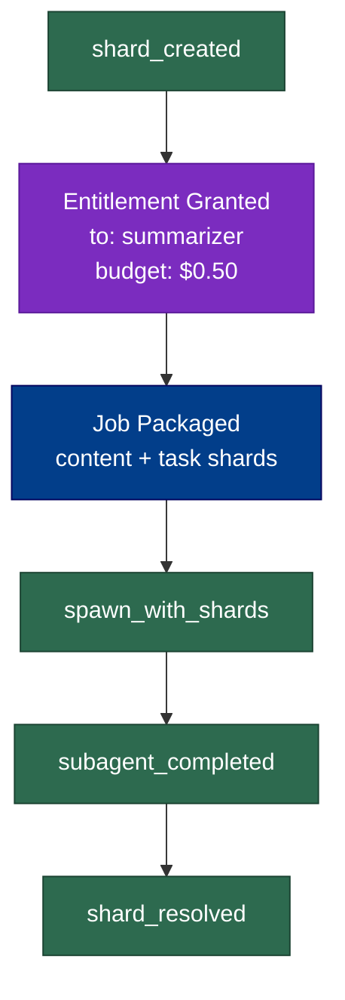

# Demo 1: Simple Trace

A single parent agent receives a request, packages it into a memory shard,
spawns one subagent with that shard via `package_job`, the subagent returns
a result shard, and the parent records completion.

## What it shows

- **ShardStore + ShardAtom basics** — creating content-addressed knowledge
  bundles and storing them to disk
- **TraceEmitter** — hash-chained provenance events (`shard_created`,
  `spawn_with_shards`, `job_completed`)
- **package_job** — encrypting content + task into shard pairs with an
  entitlement token for the subagent
- **Child trace** — the subagent emits its own trace chain; the parent
  references it by `child_run_id`
- **verify_chain()** — proves neither trace was tampered with
- **render_trace()** — generates a Mermaid diagram of the workflow

## How to run

```bash
python examples/01_simple_trace/run.py
```

## Example output

### Parent trace (`traces/parent.jsonl`)

Each line is a JSON event. Notice `prev_event_hash` linking each event to
the prior one — change one byte and `verify_chain` fails.

```json
{"type": "shard_created", "run_id": "parent-run-001", "agent_id": "orchestrator", "prev_event_hash": null, "shard_id": "1010b5a0...", "scope": "demo:request", "atom_count": 2, "hash": "1ae4dfd1..."}
{"type": "entitlement_granted", "prev_event_hash": "1ae4dfd1...", "granted_to": "summarizer", "capabilities": ["shard:read", "shard:write", ...], "budget_usd": 0.5, "hash": "e79b237c..."}
{"type": "job_packaged", "prev_event_hash": "e79b237c...", "content_shard_id": "dba4c900...", "task_shard_id": "d238667e...", ...}
{"type": "spawn_with_shards", ...}
{"type": "subagent_completed", ...}
{"type": "shard_resolved", ...}
```

### Child trace (`traces/child.jsonl`)

The subagent's independent chain — starts with capability checks, decrypts
the shards with its entitlement key, does the work, and records completion.

```json
{"type": "capability_checked", "run_id": "child-run-001", "agent_id": "summarizer", "capability": "shard:read", "allowed": true, ...}
{"type": "shard_decrypted", "scope": "demo:content", ...}
{"type": "shard_decrypted", "scope": "demo:task", ...}
{"type": "job_started", ...}
{"type": "budget_spent", ...}
{"type": "shard_created", ...}
{"type": "job_completed", "spent_usd": 0.03, ...}
```

### Workflow diagram



## Takeaway

Trace isn't logging — it's a cryptographic receipt. Every shard creation,
every subagent spawn, every budget spend is hash-chained. If any event is
modified after the fact, the chain breaks and `verify_chain()` returns
`False`.
