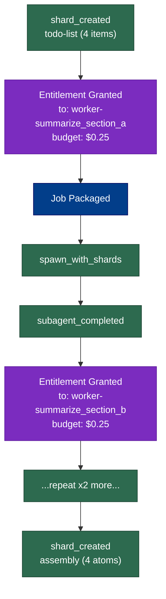

# Demo 2: Todo Fan-Out

Parent agent receives a compound request, creates a todo-list shard (one
atom per task), then fans out to N subagents. Each subagent emits its own
trace and writes a result shard. Parent assembles all results into a
single assembly shard with lineage back to each source.

## What it shows

- **Multi-child fan-out** — 4 subagents with distinct `run_id`s, each
  producing its own trace chain
- **Content-addressing lineage** — each result atom carries a `source_ref`
  pointing back to the todo-list shard's atom content hash
- **Assembly shard** — collects results from all subagents, with
  `source_ref` on each atom linking to the shard that produced it
- **ShardStore.get()** — hydrates every referenced shard from disk to show
  what a downstream agent would see

## How to run

```bash
python examples/02_todo_fanout/run.py
```

## Example output

### Parent trace pattern (`traces/parent.jsonl`)

The parent repeats this pattern four times (once per subagent), then
creates the assembly shard:

```
shard_created          ← todo-list shard
  entitlement_granted  ← grant to worker-summarize_section_a ($0.25)
  job_packaged         ← content + task shards
  spawn_with_shards    ← dispatch subagent
  subagent_completed   ← result received
  entitlement_granted  ← grant to worker-summarize_section_b ($0.25)
  ...                  ← repeat for all 4 workers
shard_created          ← assembly shard (4 atoms)
```

### Lineage

The assembly shard's atoms each carry a `source_ref` pointing at the
result shard that produced them — you can walk the full chain:

```
assembly atom "result.summarize_section_a" -> source: 65117c83...
assembly atom "result.summarize_section_b" -> source: 2fbe44b9...
assembly atom "result.extract_entities_c"  -> source: 05bc9e26...
assembly atom "result.extract_entities_d"  -> source: ce5b273a...
```

### Workflow diagram



### Input document

**`input.md`** contains the bundled document the subagents "process". In a
real system this would be a research paper, codebase, or dataset.

## Takeaway

Fan-out is a common pattern for compound tasks. Fabric makes each
subagent's work independently verifiable (its own trace chain) while the
parent's trace captures the full orchestration. The assembly shard's
`source_ref` fields make lineage queryable — you can always answer "where
did this fact come from?"
