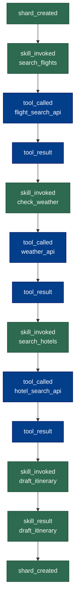

# Demo 3: Skills and Tools in the Audit Trail

An agent uses multiple "skills" (compound capabilities) and "tools"
(external side-effects) to plan a weekend trip. Every invocation is
recorded in the trace chain with input/output hashes.

## What it shows

- **`skill_invoked` events** — recorded before each skill call with the
  skill name and a hash of the input arguments
- **`tool_called` / `tool_result` events** — recorded around each tool
  invocation (simulated HTTP APIs) with argument and output hashes
- **Nesting** — a skill (`search_flights`) internally calls a tool
  (`flight_search_api`), and both are visible in the trace
- **Pure skills** — `draft_itinerary` calls no tools, just synthesizes
  data. The trace shows `skill_invoked` + `skill_result` with no
  `tool_called` in between.

## How to run

```bash
python examples/03_skills_and_tools/run.py
```

## Example output

### Event sequence (`traces/agent.jsonl`)

The trace captures every skill invocation and tool call with input/output
hashes. Re-run the demo and the hashes are identical (deterministic canned
data). In production, these let you verify what the agent consumed.

```
shard_created
SKILL  search_flights   (input: 893fc469...)
  TOOL flight_search_api  (args: 893fc469...)
  TOOL flight_search_api -> (output: d8668f3a...)
SKILL  check_weather    (input: 2086e1d9...)
  TOOL weather_api        (args: 2086e1d9...)
  TOOL weather_api      -> (output: bf3adaed...)
SKILL  search_hotels    (input: e5e9f48d...)
  TOOL hotel_search_api   (args: e5e9f48d...)
  TOOL hotel_search_api -> (output: 389988d0...)
SKILL  draft_itinerary  (input: e1c1692b...)
SKILL  draft_itinerary -> (output: 23aa8042...)
shard_created
```

Notice `draft_itinerary` has no `tool_called`/`tool_result` — it's a pure
synthesis step. The trace makes this distinction visible: skills that call
external tools vs. skills that reason over existing data.

### Sample result

```
Weekend Trip to Portland, OR
===================================

Flight: Alaska SFO 17:00 -> PDX 19:05 ($129)
Hotel: Jupiter Hotel ($142/night, 4.1 stars)

Weather:
  Saturday: Partly cloudy, 68F/52F
  Sunday: Sunny, 72F/54F

Estimated total: $413
```

### Workflow diagram



## Takeaway

When an agent has access to tools (APIs, databases, file systems), every
invocation should be in the trace. The input/output hash pattern lets you
audit *what data the agent consumed* and *what it produced* without
storing the full payloads in the trace itself — just the hashes. If you
need the payloads, store them as shards and reference them by ID.
