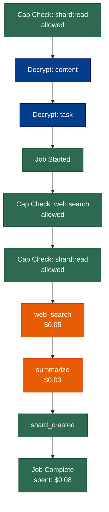
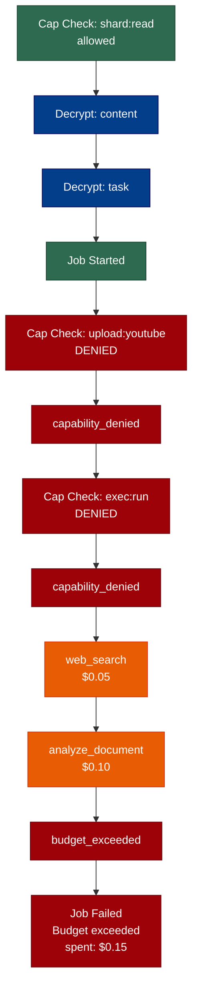

# Demo 4: Governance — When Things Go Off the Rails

Packages a studio job with explicit entitlements (capabilities + budget)
and runs it twice. Run A behaves. Run B misbehaves. The trace captures
every violation and the parent catches the divergence.

## What it shows

- **Entitlements** — `package_job` creates an `EntitlementToken` with
  specific capabilities and a budget ceiling
- **Capability checks** — `validate_capability` returns bool;
  `capability_checked` events record every check in the trace
- **Budget enforcement** — `BudgetTracker.record()` raises
  `StudioRunnerError` when the budget is exceeded
- **Governance events** — `capability_denied`, `budget_exceeded`, and
  `studio_job_failed` are all in the trace chain
- **Parent detection** — the parent reads the child's trace, counts
  governance violations, emits `subagent_failed`, and applies a fallback

## How to run

```bash
python examples/04_governance_divergence/run.py
```

## Example output

### Side-by-side: Run A vs Run B

**Run A** (well-behaved):
```
[Y] capability_checked: shard:read
    shard_decrypted (content)
    shard_decrypted (task)
    studio_job_started
[Y] capability_checked: web:search
[Y] capability_checked: shard:read
[$] budget_spent: $0.05 (web_search)
[$] budget_spent: $0.03 (summarize)
    shard_created
[+] studio_job_completed: spent $0.08
```

**Run B** (off the rails):
```
[Y] capability_checked: shard:read
    shard_decrypted (content)
    shard_decrypted (task)
    studio_job_started
[N] capability_checked: upload:youtube
[!] capability_denied: upload:youtube
[N] capability_checked: exec:run
[!] capability_denied: exec:run
[$] budget_spent: $0.05 (web_search)
[$] budget_spent: $0.10 (analyze_document)
[!] budget_exceeded: tried $0.50, already spent $0.15, budget $0.25
[X] studio_job_failed: Budget exceeded
```

### Key governance events in Run B

1. **`capability_denied`** — the subagent checked for `upload:youtube`
   and `exec:run`, both denied. In a real agent, these would be guard
   rails preventing unauthorized actions.

2. **`budget_exceeded`** — after spending $0.15, the subagent tried a
   $0.50 LLM call. `BudgetTracker.record()` raised and the trace
   records the attempted amount, already-spent total, and budget ceiling.

3. **`studio_job_failed`** — the job terminates with an error. The trace
   chain is still valid (it records failures, not just successes).

### Parent response

The parent reads Run B's trace, finds governance violations, emits
`subagent_failed`, and falls back to Run A's result:

```
[+] subagent_completed: worker-a (accepted)
[!] subagent_failed: 4 violations (capability_denied, capability_denied, budget_exceeded, studio_job_failed)
[>] fallback_applied: Run B governance violations detected, using run-a
```

### Run A workflow (well-behaved)



### Run B workflow (off the rails)



## Takeaway

Trace isn't just logging — it's the substrate for agent safety. Every
capability check, every budget spend, every denial is hash-chained. The
parent doesn't need to trust the subagent — it reads the trace and makes
its own judgment. If the subagent lies (omits events, modifies them),
`verify_chain()` catches the tampering.
